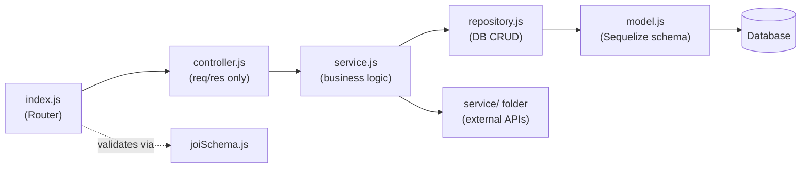
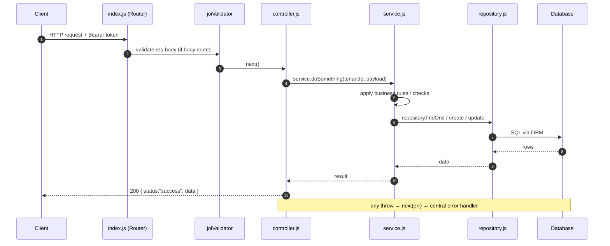

# Architecture Refactor Prompt

> **Purpose:** Use this prompt verbatim (or adapt it) when you want an AI agent to refactor
> another Node.js/Express backend into a clean, documented modular architecture identical to this
> project — but with one important upgrade: a proper three-layer separation
> **Controller → Service → Repository**.

---

## The Prompt

---

You are an expert Node.js/Express backend architect. I want you to **refactor my existing backend project** into a clean, well-structured modular architecture. Read all existing code first, understand what the project does, then perform the refactor according to the rules below.

---

### 1. Target Architecture — Overview

The project must become a **single Express monolith** organized as **module-per-domain** — roughly one folder per data entity or feature. No microservices. No message queue.

The overall shape:

```
project-root/
├── app.js               # Express assembly: middleware, routers, error handler
├── bin/www              # HTTP server bootstrap
├── config/              # DB, Redis, external service configs
├── constants/           # Shared enums, attribute maps
├── middlewares/         # Cross-cutting Express middleware
├── modules/             # ALL domain feature modules (see §2)
├── routes/              # Central routing: index.js, v1.js, admin.js, website.js (as applicable)
├── service/             # Third-party integration wrappers (payments, SMS, push, etc.)
├── utils/               # Framework-agnostic helpers (JWT, cron, PDF, S3, query builder, etc.)
├── migrations/          # sequelize-cli (or your ORM) migrations
├── seeders/             # Base/seed data
└── .env / example.env
```

---

### 2. Module Anatomy — Three-Layer Separation (CRITICAL)

Every feature lives in `modules/<entity>/`. Each module **must** follow this exact file layout:

```
modules/<entity>/
├── index.js          # Express Router — HTTP verb + path → controller method + middleware
├── controller.js     # HTTP layer ONLY: parse req, call service, send res. NO business logic here.
├── service.js        # Business logic layer: orchestration, validations, decisions, external calls
├── repository.js     # Data-access layer ONLY: raw DB CRUD via Sequelize (or your ORM)
├── model.js          # Sequelize model: DataTypes, hooks, associations
├── joiSchema.js      # Joi validation schemas (request body, query params)
├── admin.js          # (optional) Admin sub-router → /api/v1/admin/<entity>
├── website.js        # (optional) Public sub-router → /api/v1/website/<entity>
└── utils.js          # (optional) Module-specific helpers, cron logic, pure computations
```

#### Layer Responsibilities (Strict)

| Layer | File | Responsibility | Must NOT do |
| --- | --- | --- | --- |
| **Controller** | `controller.js` | Parse `req` (body, params, query, user), call `service.*`, send `res` | Business logic, DB calls, external API calls |
| **Service** | `service.js` | Validate business rules, orchestrate multi-step flows, call `repository.*`, call external services (`service/` folder) | Parse `req`/`res`, raw ORM/SQL queries |
| **Repository** | `repository.js` | Sequelize (or ORM) `create`, `findOne`, `findAll`, `findAndCountAll`, `update`, `delete`, `count` — nothing else | Business logic, HTTP concerns |

**Example — creating a student:**

```js
// controller.js
exports.create = async (req, res, next) => {
  try {
    const { id: academyId } = req.user
    const data = await service.create(academyId, req.body)
    res.status(201).json({ status: "success", data })
  } catch (error) {
    next(error)
  }
}

// service.js
exports.create = async (tenantId, payload) => {
  // business rule: check duplicate mobile within tenant
  const existing = await repository.findOne({ where: { mobile: payload.mobile, tenantId } })
  if (existing) throw createError(409, "A record with this mobile already exists")
  return repository.create({ ...payload, tenantId })
}

// repository.js
exports.create    = (data)          => Model.create(data)
exports.findOne   = (options)       => Model.findOne(options)
exports.findAll   = (options)       => Model.findAll(options)
exports.update    = (data, options) => Model.update(data, { ...options, individualHooks: true })
exports.delete    = (options)       => Model.destroy(options)
exports.count     = (options)       => Model.count(options)
exports.findAndCountAll = (options) => Model.findAndCountAll(options)
```

---

### 3. Routing Strategy

Routing is **central and hierarchical**. `routes/index.js` mounts up to three portal surfaces:

```
routes/index.js
  ├── /api/v1         → routes/v1.js       (authenticated app API)
  ├── /api/v1/admin   → routes/admin.js    (internal admin, role-guarded)
  └── /api/v1/website → routes/website.js  (public/unauthenticated)
```

**Order is security-critical in `routes/v1.js`:**
1. Mount **public** routes first (webhooks, `/auth`, `/appConfig`, public utils).
2. Then `router.use(authMiddleware)` — everything after this requires a valid token.
3. Then protected module routes (most wrapped in `checkSubscription` or equivalent gate).

Each module exposes:
- `index.js` → app router (`/api/v1/<entity>`)
- `admin.js` (optional) → admin portal
- `website.js` (optional) → public website

---

### 4. Middleware

Define all shared middleware in `middlewares/`:

| Middleware | Purpose |
| --- | --- |
| `authMiddleware` | Verify JWT, load user by role, set `req.user`; remap sub-user → tenant id |
| `protectRoute(roles[])` | RBAC — 403 if `req.user.role` not in allow-list |
| `checkSubscription` | Gate features on an active subscription (if applicable) |
| `joiValidator(schema)` | Validate `req.body`; return 422 on failure |
| `rateLimiter` | Redis-backed rate limits on sensitive endpoints (OTP, login, etc.) |
| `upload` / `localUpload` | Multer for file uploads (direct S3 or local + resize) |

---

### 5. Error Handling

Use a **single central error handler** in `app.js` (last middleware). No `asyncHandler` wrapper — use manual `try/catch` + `next(error)`.

```js
// app.js — expose createError globally (http-errors)
global.createError = require("http-errors")

// Central error handler (last middleware in app.js)
app.use((err, req, res, next) => {
  // normalize Sequelize errors, JWT errors, etc.
  // report 5xx to monitoring service
  res.status(err.status || 500).json({ status: "fail", message: err.message })
})
```

---

### 6. Response Envelope (Consistent across all controllers)

```js
// Success with data
res.status(200).json({ status: "success", data: result })

// Created
res.status(201).json({ status: "success", data: result })

// Success with message only
res.status(200).json({ status: "success", message: "Done" })

// Error (handled by central handler, never thrown manually in res)
{ status: "fail", message: "..." }
```

---

### 7. Code Style & Conventions

- **CommonJS** modules (`require` / `module.exports`)
- **`"use strict"`** at top of every file
- **Double quotes** for strings
- **No semicolons** (follow existing project style)
- **2-space indent**
- **camelCase** for files, variables, functions
- **PascalCase** for Sequelize models
- **UPPER_SNAKE_CASE** for true constants only
- Import order: (1) Node built-ins → (2) third-party packages → (3) internal modules → (4) relative imports
- Always wrap async controller methods in `try/catch`; forward errors with `next(error)`
- Use **Sequelize transactions** for multi-table write operations
- Enable `paranoid: true` on models that need soft-delete
- Use `individualHooks: true` in bulk `update` calls when model hooks must fire

---

### 8. Validation

- Use **Joi** for all request validation; schemas live in `joiSchema.js` per module
- Apply via `joiValidator(schema)` middleware in route definitions (NOT inside controller or service)
- Use `.messages()` for custom, user-facing error strings

---

### 9. Database Conventions

- ORM: **Sequelize** (MySQL preferred; adapt if your DB differs)
- No central `models/` folder — each module owns its `model.js` and declares associations at the bottom of that file
- Schema is **migration-driven** (`sequelize-cli`) — never use `.sync({ force: true })` in production code
- Query-string operators (pagination, sort, filter, date ranges) must be abstracted into a shared utility (`utils/query.js`) — do not duplicate per-module

---

### 10. Multi-Tenancy / Scoping (if applicable)

- `authMiddleware` must normalize `req.user.id` to the **tenant id** for all user types (including remapping sub-users like coaches, staff, etc.)
- Services must receive `tenantId` as an **explicit parameter** — never import or read `req` inside a service or repository
- Every repository query that touches tenant data must include `{ where: { tenantId } }`

---

### 11. External Service Integrations

Place all third-party integration wrappers in `service/` (singular, at project root) — not inside any module:

```
service/
├── payment.js     # Payment gateway (Razorpay / Stripe / Easebuzz / Cashfree)
├── msg.js         # SMS / WhatsApp (MSG91, Twilio, etc.)
├── firebase.js    # Push notifications (FCM)
└── storage.js     # File storage (AWS S3, GCS, etc.)
```

- **Services call these wrappers; controllers never touch external APIs directly.**
- Controllers call `service.js`; `service.js` calls `service/` integrations.

---

### 12. Background Jobs

All scheduled/background work via **`node-cron`**, registered in `utils/cron.js` at boot (loaded by `app.js`). No message queue unless explicitly required. Cron job handler functions live in the relevant module's `utils.js` and are simply called from `utils/cron.js`.

---

### 13. Documentation to Generate

After completing the refactor, **generate a `docs/` folder** at the project root with the following structure. Follow this exact documentation style: Mermaid diagrams (flowchart and sequenceDiagram), markdown tables, cross-links between docs, code examples. Docs must describe the system **as-is after refactor**, not aspirationally.

```
docs/
├── README.md
│     Contents: docs index table (what each doc covers), reading order, conventions used
│
├── system-architecture.md
│     Contents: system overview (what the app does, shape of the system), technology stack
│     table, high-level architecture Mermaid flowchart, request flow summary sequence diagram,
│     the portals (app / admin / website), running locally steps, deep-dive index
│
└── architecture/
    ├── 01-request-flow.md
    │     Contents: boot sequence, full request lifecycle sequence diagram (autonumber),
    │     global middleware pipeline table (order matters), per-route middleware section,
    │     full middleware catalog table, error handling flow Mermaid flowchart,
    │     response envelope table
    │
    ├── 02-folder-structure.md
    │     Contents: repo layout tree, top-level folder responsibility table,
    │     module anatomy section (the three-layer Controller/Service/Repository pattern
    │     with Mermaid flowchart + worked example table), routing strategy Mermaid flowchart,
    │     key routing rules
    │
    ├── 03-auth.md
    │     Contents: roles table, login/signup sequence diagrams per role,
    │     authMiddleware flowchart, multi-tenancy / scoping explanation and code examples,
    │     rate limiting table
    │
    ├── 04-database.md
    │     Contents: engine & config, models & migrations philosophy, core domain entities table
    │     (entity / file / notable fields / key associations), ER diagram (Mermaid erDiagram),
    │     Redis usage section
    │
    └── 05-external-services.md
          Contents: integrations-at-a-glance table, payment link creation explanation,
          payment flow sequence diagram, subscription/billing flow sequence diagram,
          notifications & PDF pipeline section, cron job schedule table
```

And optionally a `docs/features/` folder with one markdown doc per major feature area. Each feature doc must follow this layout:
1. **Overview** — what it does and where it fits
2. **Data Model** — table columns/types/associations + Mermaid ER diagram
3. **How It Works** — business flows + Mermaid sequence/flow diagram
4. **API Endpoints** — method, path, portal, auth, validation, behavior
5. **Background Jobs & Integrations** — cron and external services (where relevant)
6. **Validation & Edge Cases** — Joi rules, constraints, gotchas
7. **Key Files** — real source paths
8. **Related Features** — cross-links to neighboring docs

---

### 14. Execution Checklist

Perform the refactor in this exact order:

- [ ] Read ALL existing code — understand every module, route, model, middleware, and utility
- [ ] Map existing modules — list every domain entity and its current file(s)
- [ ] Create the new folder structure (do not delete old code yet)
- [ ] For each module: create `model.js`, `repository.js` (extract all DB calls), `service.js` (extract all business logic), `controller.js` (leave only req/res handling), `joiSchema.js`, `index.js` (wire routes)
- [ ] Wire central routing (`routes/v1.js`, `routes/admin.js`, `routes/website.js`)
- [ ] Ensure all shared middleware is in `middlewares/` and applied correctly
- [ ] Move external service wrappers to `service/` folder
- [ ] Move framework-agnostic helpers to `utils/`
- [ ] Clean up old files once new structure is verified working
- [ ] Generate `docs/` as specified in §13
- [ ] Lint the entire codebase (`npm run lint`)
- [ ] Start server (`npm run dev`) and verify it boots without errors

---

### 15. What NOT to Do

- ❌ Do not put business logic in `controller.js`
- ❌ Do not put DB queries in `controller.js` or `service.js`
- ❌ Do not read `req` or `res` inside `service.js` or `repository.js`
- ❌ Do not create a central `models/` folder — models live in their module
- ❌ Do not use `.sync({ force: true })` in production code
- ❌ Do not skip the `docs/` generation step
- ❌ Do not duplicate query-building logic — put it in `utils/query.js`
- ❌ Do not use `async/await` without `try/catch` in controllers
- ❌ Do not call external service wrappers (from `service/`) directly from `controller.js` — always go through the module's `service.js`
- ❌ Do not pass `req` or `res` into service or repository functions

---

### 16. Reference Architecture Diagrams

#### Layer flow inside a module



#### Request lifecycle sequence



---

*Generated from the Khelnet Backend v2 reference project.*
*Reference docs: `docs/system-architecture.md`, `docs/architecture/`.*
