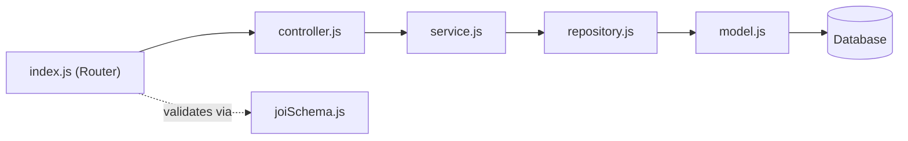

# Documentation Generation Prompt

> **Purpose:** Give this prompt to an AI agent to generate a complete `docs/` folder for any
> existing Node.js/Express backend. The output will mirror the Khelnet Backend v2 documentation
> style — Mermaid diagrams, tables, cross-linked markdown files — written as a living reference
> for engineers joining the project.

---

## The Prompt

---

You are an expert technical writer and Node.js/Express backend architect.

I want you to **read my entire existing backend codebase** and generate a complete `docs/` folder
that documents the system **as-it-is today** — not aspirationally, not with invented details.
Every fact, module name, endpoint, model field, middleware, and external integration must come
from the actual source code. Do not invent or assume anything that isn't in the code.

---

### Step 0 — Read Before You Write (MANDATORY)

Before writing a single line of documentation, read **all** of the following in full:

1. `app.js` / `index.js` / `bin/www` — app bootstrap, middleware chain, port, error handler
2. `routes/` — every router file; understand all route prefixes, mount order, public vs protected
3. `middlewares/` — every middleware file; understand what each one does and where it's applied
4. `modules/` — **every module folder**; for each module read `index.js`, `controller.js`,
   `service.js`, `repository.js` (or `service.js` if no repo layer), `model.js`, `joiSchema.js`
5. `config/` — DB config, Redis, external service config files
6. `utils/` — all helpers, cron jobs, query builders, JWT/bcrypt wrappers
7. `service/` (root-level, if present) — third-party integration wrappers
8. `package.json` — runtime, dependencies, npm scripts
9. `.env` / `example.env` — environment variable names (values don't matter)
10. Any existing markdown files (README, API docs, etc.) — for context only

Only after reading everything above, proceed to generate the docs.

---

### Step 1 — Generate `docs/README.md`

The entry-point index for the docs folder. Must contain:

- A one-sentence description of what the project is
- A reading-order recommendation ("new here? start with `system-architecture.md`")
- A **table** listing every doc file with columns: `Doc | Read it to learn…`
- A "Conventions used in these docs" section (Mermaid, code references, as-is policy)

---

### Step 2 — Generate `docs/system-architecture.md`

The big-picture overview. Must contain all of these sections:

#### 2.1 System Overview
- What the system does (2–4 sentences)
- Shape of the system: monolith vs microservice, module count, DB(s) used, caching, queues

#### 2.2 Technology Stack
A **markdown table** with columns: `Layer | Technology | Version | Purpose`
Extract versions from `package.json`. Cover: runtime, web framework, ORM/query builder, database,
cache, auth, validation, file storage, notifications, scheduling, monitoring, tooling.

#### 2.3 High-Level Architecture Diagram
A **Mermaid `flowchart TB`** showing:
- Client types (web app, mobile app, admin portal, public website — only those that exist)
- The Express monolith box with sub-boxes: global middleware, routers, auth middleware, modules, cron
- Data stores (DB, Redis — only those that exist)
- External services (payment gateways, SMS, push, S3 — only those that actually exist in the code)
- Arrows showing data flow including webhooks if present

#### 2.4 Request Flow (summary)
A **Mermaid `sequenceDiagram`** for a typical authenticated request, showing every hop:
client → global middleware → router → auth middleware → subscription/gate middleware (if any) →
module router → joi validator (if applicable) → controller → service → repository → DB → back

#### 2.5 The Portals / Route Surfaces
A **table** listing each route prefix (`/api/v1`, `/api/v1/admin`, `/api/v1/website`, etc.),
its router file, audience, and auth requirement. Only include surfaces that actually exist.

#### 2.6 Running Locally
Exact numbered steps extracted from `package.json` scripts and `.env` / `example.env`:
install → configure env → run migrations/seeds (if applicable) → start dev server.
List the key environment variables that must be set.

#### 2.7 Deep-Dive Index
Numbered list linking to every doc in `docs/architecture/` and `docs/features/`.

---

### Step 3 — Generate `docs/architecture/01-request-flow.md`

Title: **Request Flow, Middleware & Error Handling**

Must contain:

#### Boot Sequence
A code block (plain text tree) tracing: `npm start` → server file → `app.js` → what gets
registered in order (env, globals, middleware, routes, cron, DB connect, 404, error handler).

#### Full Request Lifecycle
A **Mermaid `sequenceDiagram` with `autonumber`** tracing the complete path of a real
authenticated endpoint from this project (pick the most representative one). Show every participant:
Client, each middleware, the module router, joi validator, controller, service, repository, DB,
error handler.

#### Global Middleware Pipeline
A **numbered table** (order matters!): `# | Middleware | Why it's there`
Extract the exact middleware from `app.js` in the exact order they are `app.use()`d.

#### Per-Route Middleware
Explain what middleware is applied per-route (auth, validation, uploads, rate limiting).
Include a short code example from a real module showing inline middleware usage.

#### Full Middleware Catalog
A **table** of every file in `middlewares/`:
`Middleware | File | Purpose | Applied where`

#### Error Handling Flow
A **Mermaid `flowchart TD`** showing how `next(err)` flows to the central handler, how different
error types are normalized (Sequelize errors, JWT errors, http-errors, generic 500), and what
response shape is sent.

#### Response Envelopes
A **table**: `Outcome | Shape` — success with data, success with message, error/fail.

---

### Step 4 — Generate `docs/architecture/02-folder-structure.md`

Title: **Folder Structure & Module Anatomy**

Must contain:

#### Repo Layout
A **plain-text directory tree** of the entire project root (one level deep for most folders,
expand `modules/` to show each module folder, expand each module to show its files).
Add inline comments (`# what this is for`) on each top-level entry.

#### Top-Level Folder Responsibilities
A **table**: `Folder | Responsibility` — one row per top-level folder.

#### Module Anatomy
The repeating file layout inside `modules/<entity>/`. Show the standard file list with a comment
on what each file is for. Then show the **layer diagram**:



*(Adapt this diagram to match the actual layer names in the project — e.g. if there is no
`repository.js` and service talks to the model directly, adjust accordingly.)*

#### Layer Responsibilities Table
`Layer | File | Responsibility | Must NOT do` — four rows (Router, Controller, Service, Repository).

#### Worked Example
Pick one real module from the project. Create a **table** showing each file and its role in a
concrete flow (e.g. "GET /quiz/:id" → what each file does).

#### Routing Strategy
A **Mermaid `flowchart TD`** showing how `routes/index.js` branches into portals, which modules
are public (before auth), which are protected (after auth middleware), and any RBAC guards.

---

### Step 5 — Generate `docs/architecture/03-auth.md`

Title: **Authentication, Roles & Multi-Tenancy** (or **Authentication & Access Control** if no
multi-tenancy)

Must contain:

#### Roles at a Glance
A **table**: `Role | Who | How they authenticate | Token/session storage`
Only include roles that actually exist in the code.

#### Login / Signup Flow(s)
One **Mermaid `sequenceDiagram` with `autonumber`** per distinct auth flow in the project
(e.g. OTP login, email+password login, OAuth). Trace: client → controller → service → DB/Redis/
external OTP service → response.

#### Protecting a Request — `authMiddleware`
A **Mermaid `flowchart TD`** showing the exact logic inside `middlewares/auth.js`:
token extraction → JWT verify → role branch → DB user load → `req.user` assignment → `next()`.
Show every rejection path (invalid token, expired, blocked user, wrong role).

#### Multi-Tenancy / Scoping (if applicable)
If the project is multi-tenant, explain how `req.user.id` is normalized to a tenant id and how
controllers/services use it. Include a short code example from a real controller.

#### Rate Limiting on Auth Endpoints (if applicable)
A **table**: `Limiter | Limit | Guards` — only if rate limiting middleware is applied to auth routes.

---

### Step 6 — Generate `docs/architecture/04-database.md`

Title: **Database — [Engine name], [ORM name] & the Domain Model**

Must contain:

#### Engine & Configuration
- What DB engine is used (MySQL / PostgreSQL / MongoDB / SQLite)
- What ORM/query builder (Sequelize / Prisma / Mongoose / Knex)
- Config file locations and what each does
- Connection pool settings if configured
- Whether schema is migration-driven or model-synced

#### Models & Migrations
- Where models live (central `models/` folder or per-module)
- How associations are declared
- Migration philosophy (migration files vs. `sync()`)
- Relevant npm scripts

#### Core Domain Entities
A **table**: `Entity | File | Notable fields | Key associations`
One row per Sequelize model (or Mongoose schema). Extract field names from actual model files.

#### ER Diagram
A **Mermaid `erDiagram`** showing the relationships between the core entities.
Include FK fields and relationship types (`||--o{`, `||--||`, etc.).

#### Redis / Cache Usage (if applicable)
Bullet list of every Redis key pattern and what it stores. Only include if Redis is used.

---

### Step 7 — Generate `docs/architecture/05-external-services.md`

Title: **External Services, Integrations & Background Jobs**

Must contain:

#### Integrations at a Glance
A **table**: `Service | File | What it does | Key env vars`
One row per third-party integration found in the code. If none, omit this section.

#### Integration Deep-Dives (one subsection per integration)
For any integration involving a non-trivial flow (e.g. payment webhooks, OTP delivery, file upload),
write a **Mermaid `sequenceDiagram`** tracing the full flow end-to-end.

#### Notification Pipeline (if applicable)
How push / SMS / email notifications are sent. Which service, which module triggers them, what
payload, and where they're persisted (if at all).

#### Cron / Scheduled Jobs
A **table**: `Schedule | Job description | Module/file`
One row per `node-cron` (or equivalent) job. Extract from `utils/cron.js` or wherever jobs are
registered. If no cron jobs exist, note that explicitly.

---

### Step 8 — Generate `docs/features/README.md`

Title: **[Project Name] — Feature Overview**

Must contain:

#### Feature List Table
`# | Feature | What it's for | Primary route surface`
One row per domain module found in `modules/`.

#### Feature Summaries
One subsection (`###`) per feature with:
- 2–4 sentence description of what it does
- The modules that implement it
- Link to the full feature doc (which you will generate next)

---

### Step 9 — Generate one `docs/features/<N>-<feature-name>.md` per module

For **each module** in `modules/`, generate a dedicated feature doc. Each doc must follow this
exact layout (all sections required; write "N/A" and a brief note if a section genuinely doesn't
apply):

```
# [Feature Name]

[← Back to Feature Overview](../features/README.md)

## 1. Overview
## 2. Data Model
## 3. How It Works
## 4. API Endpoints
## 5. Background Jobs & Integrations
## 6. Validation & Edge Cases
## 7. Key Files
## 8. Related Features
```

#### Section specs:

**1. Overview** — What this feature does, who uses it, which portal/route surface, 3–5 sentences.

**2. Data Model** — For each model in this module:
- A table: `Column | Type | Nullable | Default | Description`
- Associations listed as bullet points
- A **Mermaid `erDiagram`** for this module's models

**3. How It Works** — Explain the main business flows (create, read, update, delete, plus any
non-CRUD flows). Include a **Mermaid `sequenceDiagram`** or **`flowchart`** for the most
important or complex flow.

**4. API Endpoints** — A **table**:
`Method | Path | Auth | Validation (Joi schema) | Controller method | Description`
Extract every route from this module's `index.js` (and `admin.js`, `website.js` if present).

**5. Background Jobs & Integrations** — Any cron jobs that touch this module, external service
calls made from this module's service layer. If none, say "No background jobs or external
integrations."

**6. Validation & Edge Cases** — List all Joi rules from `joiSchema.js`, plus any business-rule
checks in `service.js` (e.g. uniqueness checks, balance checks, state machine transitions).
Note any known edge cases or gotchas found in the code.

**7. Key Files** — A table: `File | Purpose` with relative paths from project root.

**8. Related Features** — Bullet list of links to other feature docs that this module depends on
or is depended upon by.

---

### Output Rules (Non-Negotiable)

1. **Every fact must come from the code.** If something isn't in the code, don't write it.
2. **All Mermaid diagrams must be syntactically valid.** Quote node labels containing parentheses
   or special characters (e.g. `id["Label (note)"]`). No HTML tags inside labels.
3. **All file links must use real paths** relative to the project root (e.g. `../modules/user/service.js`).
4. **Write docs in the present tense** ("The controller reads `req.user.id`…" not "will read").
5. **Cross-link generously** — every doc must link back to `system-architecture.md` and forward
   to related docs.
6. **No invented endpoints, fields, or behaviors.** If you are unsure about something, note it
   explicitly as "TODO: verify" rather than guessing.
7. **Preserve the reading-order flow**: `README.md` → `system-architecture.md` → architecture
   deep-dives → features. Each doc must have a `← Back to …` link at the top.
8. **Generate all files in one pass.** Do not ask for confirmation between files.

---

### Final Checklist Before Finishing

- [ ] `docs/README.md` — index with table of all docs
- [ ] `docs/system-architecture.md` — all 7 sections present
- [ ] `docs/architecture/01-request-flow.md` — boot sequence, lifecycle diagram, middleware table, error flow
- [ ] `docs/architecture/02-folder-structure.md` — tree, table, module anatomy, routing diagram
- [ ] `docs/architecture/03-auth.md` — roles, login flows, authMiddleware diagram
- [ ] `docs/architecture/04-database.md` — engine, models, ER diagram
- [ ] `docs/architecture/05-external-services.md` — integrations table, flows, cron table
- [ ] `docs/features/README.md` — feature list table + summaries
- [ ] One `docs/features/<N>-<name>.md` per module — all 8 sections present

---

*Use this prompt in the project where you want documentation generated.*
*Reference style: Khelnet Backend v2 — `docs/` folder.*
