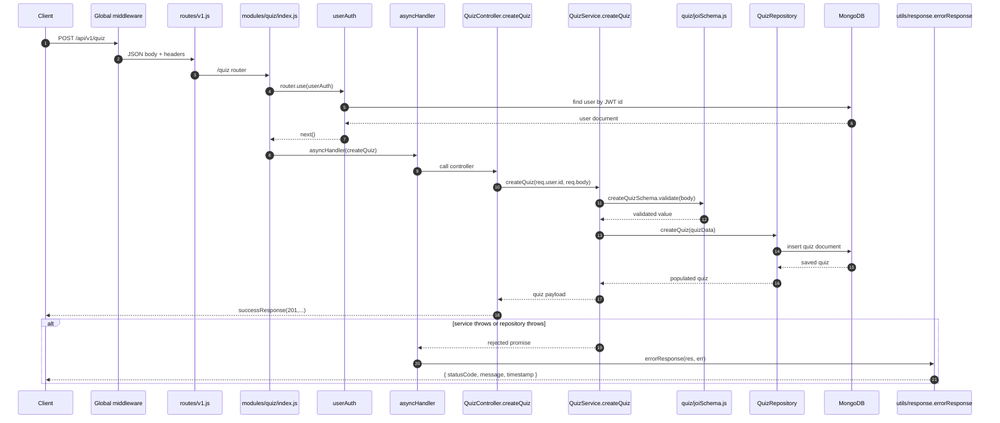
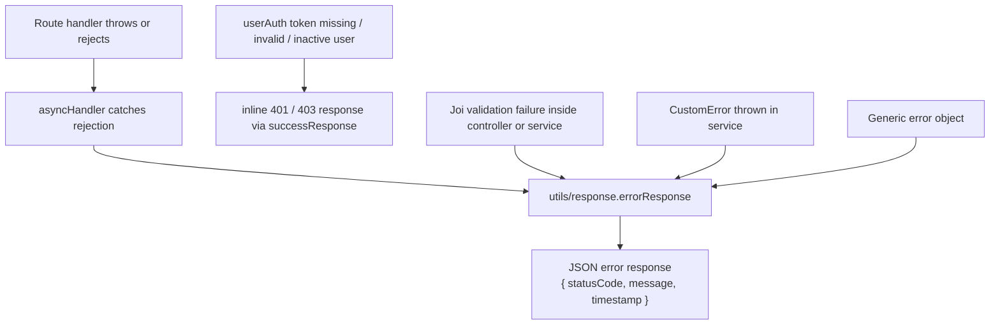

# Request Flow, Middleware & Error Handling

[← Back to System Architecture](../system-architecture.md)

## Boot Sequence

```text
npm start
└─ node index.js
   ├─ require("dotenv").config()
   ├─ load app from ./app
   ├─ load connectToDB from ./config/db
   ├─ set PORT from process.env.PORT || 3000
   ├─ connectToDB()
   │  └─ mongoose.connect(process.env.MONGODB_URI)
   └─ app.listen(PORT)
      └─ app.js registrations already in place
         ├─ express.json()
         ├─ cors()
         ├─ requestLogger
         ├─ app.use("/api/v1", v1Router)
         └─ GET / health check
```

## Full Request Lifecycle



## Global Middleware Pipeline

| # | Middleware | Why it is there |
| --- | --- | --- |
| 1 | `express.json()` | Parses JSON request bodies for controllers and services. |
| 2 | `cors()` | Allows cross-origin requests from browser clients. |
| 3 | `requestLogger` | Logs method and URL and sets the `X-Powered-By` response header. |

## Per-Route Middleware

The module routers apply authentication at the router level and then wrap controller methods with `asyncHandler`.

```js
// modules/quiz/index.js
router.use(userAuth)
router.post("/", asyncHandler(controller.createQuiz))
router.post("/:quizId/attempt", asyncHandler(controller.submitAttempt))
```

- `userAuth` runs before every quiz, MCQ, master, and performance endpoint.
- `asyncHandler` catches rejected promises from controllers and forwards them to `utils/response.errorResponse`.
- Validation is not applied as Express middleware; the services and one controller validate with Joi inside the handler path.
- There is no upload middleware and no rate limiting middleware in the current code.

## Full Middleware Catalog

| Middleware | File | Purpose | Applied where |
| --- | --- | --- | --- |
| `requestLogger` | `middlewares/requestLogger.js` | Logs requests and adds a custom response header. | Globally in `app.js`. |
| `asyncHandler` | `middlewares/asyncHandler.js` | Wraps async handlers and sends errors to `errorResponse`. | All module routes that use it. |
| `userAuth` | `middlewares/auth.js` | Verifies JWTs, loads the user, and attaches `req.user`. | `user`, `master`, `mcq`, `quiz`, and `performance` routers. |
| `adminAuth` | `middlewares/auth.js` | Blocks non-admin users. | Defined in code, but not currently mounted on any route. |

## Error Handling Flow



Notes:

- The code does not define a separate Express 404 middleware or central `app.use((err, req, res, next) => ...)` error handler.
- The code does not contain Sequelize-specific normalization because the project uses Mongoose, not Sequelize.
- JWT verification failures are handled inline in `middlewares/auth.js` and return a 401 response directly.

## Response Envelopes

| Outcome | Shape |
| --- | --- |
| Success with data | `successResponse(statusCode, data, message)` returns `{ statusCode, data, message }`. |
| Success with message only | `successResponse(statusCode, null, message)` returns the same envelope with `data: null`. |
| Error / fail | `errorResponse(res, err)` returns `{ statusCode, message, timestamp }`. Some middleware paths return `{ statusCode, data: null, message }` directly. |

