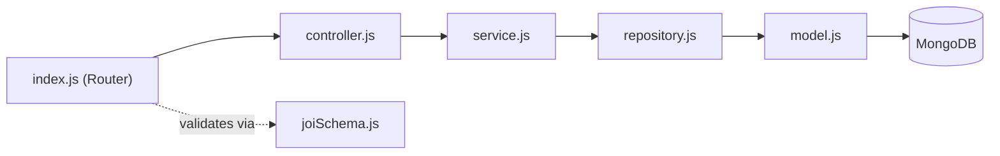
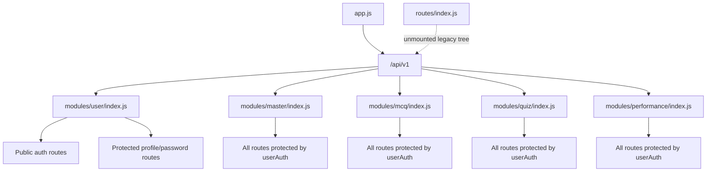

# Folder Structure & Module Anatomy

[← Back to System Architecture](../system-architecture.md)

## Repo Layout

```text
QMark-backend/ # Express + MongoDB backend root
├── app.js # Express app configuration and mounted routers
├── index.js # Server bootstrap and MongoDB connection
├── config/ # Database configuration
│   └── db.js # Mongoose connection helper
├── docs/ # Generated documentation
│   ├── README.md # Docs landing page
│   ├── system-architecture.md # System overview
│   ├── architecture/ # Deep-dive architecture docs
│   └── features/ # Feature docs per module
├── middlewares/ # Shared request middleware
│   ├── asyncHandler.js # Async wrapper for controllers
│   ├── auth.js # JWT auth and admin guard
│   └── requestLogger.js # Request logging middleware
├── modules/ # Domain modules
│   ├── master/ # Subject and topic management
│   │   ├── controller.js
│   │   ├── index.js
│   │   ├── repository.js
│   │   ├── service.js
│   │   ├── subjectModel.js
│   │   └── topicModel.js
│   ├── mcq/ # Question library and interactions
│   │   ├── controller.js
│   │   ├── index.js
│   │   ├── joiSchema.js
│   │   ├── model.js
│   │   ├── optionClickModel.js
│   │   ├── repository.js
│   │   └── service.js
│   ├── performance/ # Activity and analytics
│   │   ├── controller.js
│   │   ├── index.js
│   │   ├── joiSchema.js
│   │   ├── model.js
│   │   ├── repository.js
│   │   └── service.js
│   ├── quiz/ # Quiz creation and attempts
│   │   ├── attemptModel.js
│   │   ├── controller.js
│   │   ├── index.js
│   │   ├── joiSchema.js
│   │   ├── model.js
│   │   ├── repository.js
│   │   └── service.js
│   └── user/ # Registration, login, and profile flows
│       ├── controller.js
│       ├── index.js
│       ├── repository.js
│       ├── service.js
│       ├── tokenModel.js
│       └── userModel.js
├── routes/ # Current v1 router plus legacy route files
│   ├── index.js # Legacy router tree; not mounted by app.js
│   ├── masterRoutes.js # Legacy master router
│   ├── mcqRoutes.js # Legacy MCQ router
│   ├── performanceRoutes.js # Legacy performance router
│   ├── quizRoutes.js # Legacy quiz router
│   ├── userRoutes.js # Legacy user router
│   └── v1.js # Live API router mounted at /api/v1
├── utils/ # Shared helpers and response wrappers
│   ├── CustomError.js
│   ├── generateToken.js
│   ├── queryBuilder.js
│   └── response.js
├── package.json # Runtime dependencies and scripts
├── package-lock.json # Locked dependency graph
├── .env # Local environment values
├── architecture-refactor-prompt.md # Refactor prompt in the repo
└── docs-generation-prompt.md # Prompt used to generate this docs tree
```

## Top-Level Folder Responsibilities

| Folder | Responsibility |
| --- | --- |
| `app.js` | Configures Express middleware and mounts the API router. |
| `config/` | Holds database wiring. |
| `docs/` | Contains the generated project documentation. |
| `middlewares/` | Shared middleware for logging, auth, and async error handling. |
| `modules/` | Feature modules with controllers, services, repositories, models, and schemas. |
| `routes/` | Live v1 router and an older unmounted router tree. |
| `utils/` | Helpers for tokens, errors, query building, and response envelopes. |
| `index.js` | Boots the server and opens the MongoDB connection. |
| `package.json` | Declares dependencies and scripts. |

## Module Anatomy

The repeating structure is:

- `index.js` routes requests.
- `controller.js` translates HTTP requests into service calls.
- `service.js` contains business rules and Joi validation.
- `repository.js` talks to MongoDB through Mongoose.
- `model.js` defines the Mongoose schema.
- `joiSchema.js` exists only in modules that validate request data with Joi.



## Layer Responsibilities Table

| Layer | File | Responsibility | Must NOT do |
| --- | --- | --- | --- |
| Router | `index.js` | Declare route paths and attach middleware. | Contain business logic or direct database writes. |
| Controller | `controller.js` | Read `req`, call services, and send responses. | Reimplement business rules or query MongoDB directly. |
| Service | `service.js` | Enforce business rules and orchestrate repositories and validation. | Know about Express response objects. |
| Repository | `repository.js` | Encapsulate Mongoose queries and persistence calls. | Decide HTTP status codes or response messages. |

## Worked Example

The `quiz` module shows the pattern clearly for `POST /api/v1/quiz` and `POST /api/v1/quiz/:quizId/attempt`.

| File | Role in the flow |
| --- | --- |
| `modules/quiz/index.js` | Mounts protected quiz routes and forwards to the controller through `asyncHandler`. |
| `modules/quiz/controller.js` | Reads `req.user.id`, route params, and body data, then formats the JSON response. |
| `modules/quiz/service.js` | Validates the body with Joi, checks ownership, grades attempts, and applies business rules. |
| `modules/quiz/repository.js` | Creates, reads, updates, and soft-deletes quiz documents and attempts. |
| `modules/quiz/model.js` | Stores quiz metadata, settings, and references to MCQs. |
| `modules/quiz/attemptModel.js` | Stores attempt answers, score, and time taken. |
| `modules/quiz/joiSchema.js` | Validates quiz creation, update, and attempt submission payloads. |

## Routing Strategy



Notes:

- The live app mounts `routes/v1.js`, not `routes/index.js`.
- `userAuth` is the only access-control middleware currently used on routes.
- `adminAuth` exists but is not wired into any current route.
