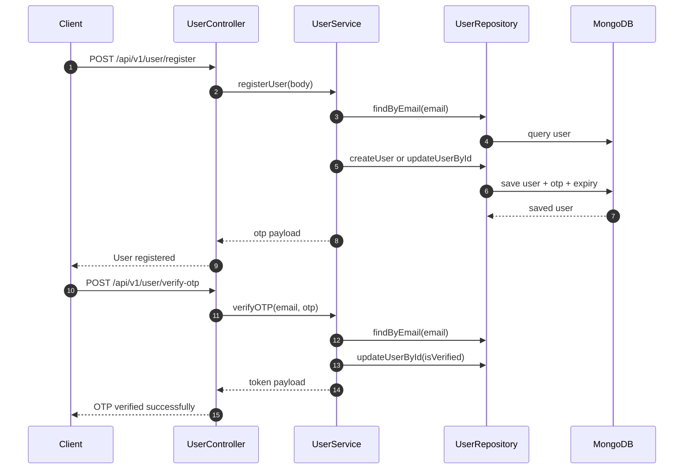
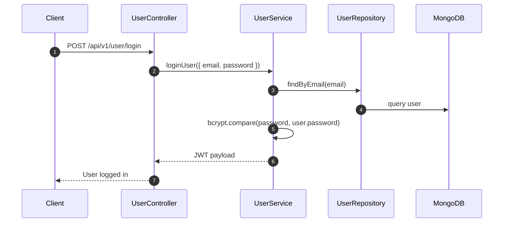
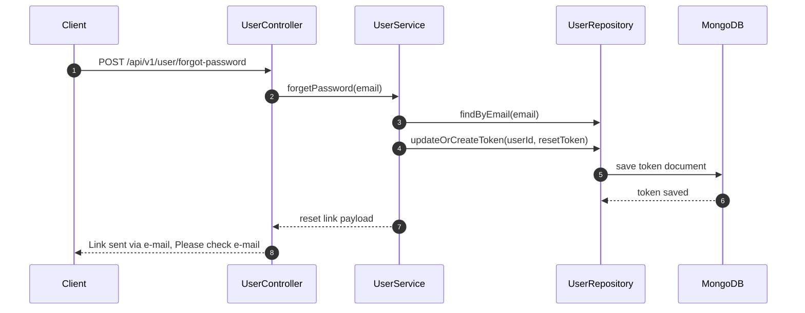
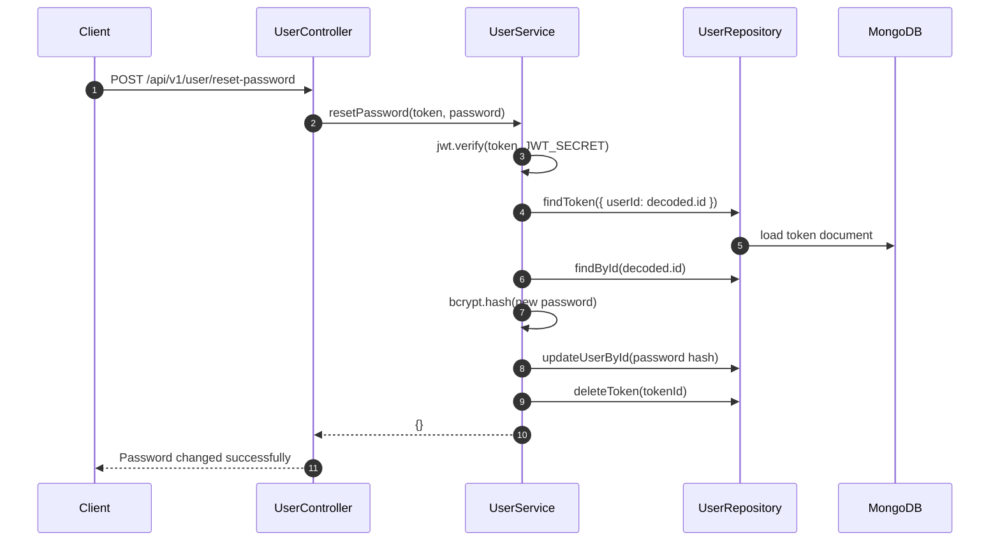
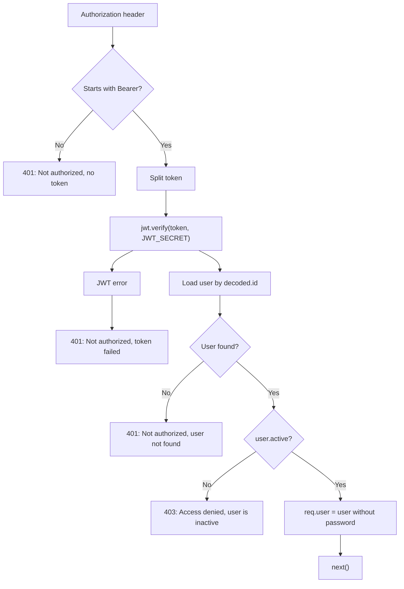

# Authentication & Access Control

[← Back to System Architecture](../system-architecture.md)

## Roles at a Glance

| Role | Who | How they authenticate | Token/session storage |
| --- | --- | --- | --- |
| `user` | Default registered account holder | JWT bearer token after login or OTP verification | JWT is returned in the response body; no server session store. |
| `admin` | User documents can carry `role: "admin"` | Same JWT flow as `user`, then `adminAuth` checks `req.user.role` | JWT is returned in the response body; no separate admin session store. |

## Login / Signup Flows

### Register and Verify OTP

### Login

### Forgot Password

### Reset Password

## Protecting a Request - `authMiddleware`

## Multi-Tenancy / Scoping

This codebase is not multi-tenant. It scopes records by `req.user.id` for ownership checks, but there is no tenant abstraction, tenant header, or tenant resolver.

For example, the MCQ and quiz services compare `mcq.user.toString()` or `quiz.user.toString()` against `userId` before allowing reads or mutations.

## Rate Limiting on Auth Endpoints

No rate limiting middleware is applied to auth routes in the current code.

