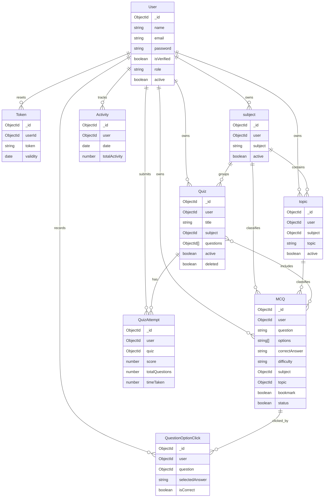

# Database - MongoDB, Mongoose & the Domain Model

[← Back to System Architecture](../system-architecture.md)

## Engine & Configuration

- The database engine is MongoDB.
- The query/model layer is Mongoose.
- The connection helper lives in `config/db.js` and calls `mongoose.connect(process.env.MONGODB_URI)`.
- The app does not define connection pool settings in code.
- The schema strategy is model-driven; there are no migration files and no `sync()` calls.

## Models & Migrations

- Models are defined per module rather than in a central `models/` folder.
- Associations are declared in Mongoose schema fields through `ref` values and populated at query time.
- The codebase does not include migration files.
- Relevant scripts are `npm run dev` and `npm start`.

## Core Domain Entities

| Entity | File | Notable fields | Key associations |
| --- | --- | --- | --- |
| `User` | `modules/user/userModel.js` | `name`, `profileImage`, `email`, `password`, `otp`, `otpExpiresAt`, `isVerified`, `role`, `active` | Referenced by MCQ, Quiz, Activity, Token, QuestionOptionClick. |
| `Token` | `modules/user/tokenModel.js` | `userId`, `token`, `validity` | Linked to `User` via `userId` for password reset. |
| `subject` | `modules/master/subjectModel.js` | `user`, `subject`, `active` | Referenced by `Topic`, `MCQ`, and `Quiz`. |
| `topic` | `modules/master/topicModel.js` | `user`, `subject`, `topic`, `active` | Belongs to `subject`; referenced by `MCQ`. |
| `MCQ` | `modules/mcq/model.js` | `user`, `question`, `options`, `correctAnswer`, `difficulty`, `subject`, `topic`, `tag`, `explanation`, `bookmark`, `status`, `comments` | Belongs to `User`, `subject`, and `topic`; contains embedded comments. |
| `QuestionOptionClick` | `modules/mcq/optionClickModel.js` | `user`, `question`, `selectedAnswer`, `isCorrect` | Belongs to `User` and `MCQ`. |
| `Quiz` | `modules/quiz/model.js` | `user`, `title`, `description`, `subject`, `questions`, `settings`, `active`, `deleted` | Belongs to `User` and `subject`; references many `MCQ` ids. |
| `QuizAttempt` | `modules/quiz/attemptModel.js` | `user`, `quiz`, `answers`, `score`, `totalQuestions`, `timeTaken` | Belongs to `User` and `Quiz`; embeds answer records. |
| `Activity` | `modules/performance/model.js` | `user`, `date`, `questionsAdded`, `practiceAttempts`, `practiceSessions`, `revisionsAttempts`, `revisionsSessions`, `totalActivity` | Belongs to `User`; indexed by `user` and `date`. |

## ER Diagram

## Redis / Cache Usage

- No Redis client or cache key pattern appears in the codebase.

