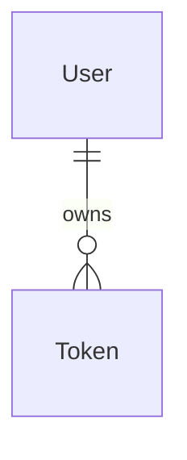
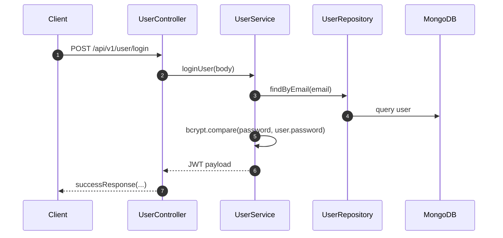

# User Account

[← Back to Feature Overview](README.md)  
[← Back to System Architecture](../system-architecture.md)

## 1. Overview

The user account feature handles registration, OTP verification, login, profile reads, forgotten-password resets, and password changes. Public routes cover the onboarding and recovery flows, while protected routes require a JWT bearer token. The module stores users and reset tokens in MongoDB through Mongoose.

## 2. Data Model

### `User`

| Column | Type | Nullable | Default | Description |
| --- | --- | --- | --- | --- |
| `name` | `String` | No | None | Display name for the account. |
| `profileImage` | `String` | Yes | None | Optional profile image URL or path. |
| `email` | `String` | No | None | Unique email address with regex validation. |
| `password` | `String` | No | None | Hashed password. |
| `otp` | `Number` | Yes | None | One-time password generated during registration and resend flows. |
| `otpExpiresAt` | `Date` | Yes | None | Expiry timestamp for the OTP. |
| `isVerified` | `Boolean` | No | `false` | Marks whether OTP verification succeeded. |
| `role` | `String` | No | `user` | Either `user` or `admin`. |
| `active` | `Boolean` | No | `true` | Controls whether the account can log in. |

- Associations:
  - Referenced by `MCQ`, `Quiz`, `Token`, `QuestionOptionClick`, and `Activity`.

### `Token`

| Column | Type | Nullable | Default | Description |
| --- | --- | --- | --- | --- |
| `userId` | `ObjectId` | No | None | User that owns the token. |
| `token` | `String` | Yes | None | JWT reset token. |
| `validity` | `Date` | Yes | `Date.now() + 10 minutes` in code | Stored expiry marker. |

- Associations:
  - Belongs to `User` through `userId`.

## 3. How It Works

1. `registerUser` checks whether the email already belongs to an active user.
2. If the account is new or inactive, the service hashes the password, generates a 6-digit OTP, and stores the user with an OTP expiry one minute in the future.
3. `verifyOTP` checks the email, compares the OTP, checks expiry, marks the user verified, and returns a JWT.
4. `loginUser` checks credentials, `active`, and `isVerified` before returning a JWT.
5. `forgetPassword` stores a reset token document and returns a reset link payload.
6. `resetPassword` verifies the JWT, matches it against the stored token, hashes the new password, updates the user, and deletes the token.

## 4. API Endpoints

| Method | Path | Auth | Validation (Joi schema) | Controller method | Description |
| --- | --- | --- | --- | --- | --- |
| POST | `/api/v1/user/register` | No | None in the route layer | `registerUser` | Creates a user and returns the generated OTP payload. |
| POST | `/api/v1/user/login` | No | None in the route layer | `loginUser` | Authenticates email/password and returns a JWT. |
| POST | `/api/v1/user/verify-otp` | No | None in the route layer | `verifyOTP` | Verifies OTP and returns a JWT. |
| POST | `/api/v1/user/resend-otp` | No | None in the route layer | `resendOTP` | Generates and returns a fresh OTP payload. |
| POST | `/api/v1/user/forgot-password` | No | None in the route layer | `forgetPassword` | Creates a reset token and reset-link payload. |
| POST | `/api/v1/user/reset-password` | No | None in the route layer | `resetPassword` | Verifies the reset token and updates the password. |
| GET | `/api/v1/user/profile` | Yes | None in the route layer | `getUser` | Returns the current user profile. |
| PUT | `/api/v1/user/change-password` | Yes | None in the route layer | `changePassword` | Changes the current user password. |

## 5. Background Jobs & Integrations

No background jobs or external integrations are defined. The service only uses JWT, bcrypt, and MongoDB.

## 6. Validation & Edge Cases

- `registerUser` rejects existing active users with `409`.
- OTPs expire after 60 seconds in `registerUser` and `resendOTP`.
- `verifyOTP` rejects invalid email, invalid OTP, and expired OTP.
- `loginUser` rejects inactive or unverified users.
- `forgetPassword` rejects missing or inactive users.
- `resetPassword` rejects invalid or expired JWT links, missing token documents, reused passwords, and missing users.
- `changePassword` rejects incorrect old passwords and new passwords that match the old password.

## 7. Key Files

| File | Purpose |
| --- | --- |
| `modules/user/index.js` | Defines public and protected user routes. |
| `modules/user/controller.js` | Translates HTTP requests into service calls. |
| `modules/user/service.js` | Implements registration, authentication, and password logic. |
| `modules/user/repository.js` | Wraps `User` and `Token` queries. |
| `modules/user/userModel.js` | Stores user account data. |
| `modules/user/tokenModel.js` | Stores password-reset tokens. |
| `middlewares/auth.js` | Verifies bearer tokens for protected user routes. |

## 8. Related Features

- [Master Content](02-master-content.md)
- [MCQ Library](03-mcq-library.md)
- [Quiz Engine](04-quiz-engine.md)
- [Performance Analytics](05-performance-analytics.md)

