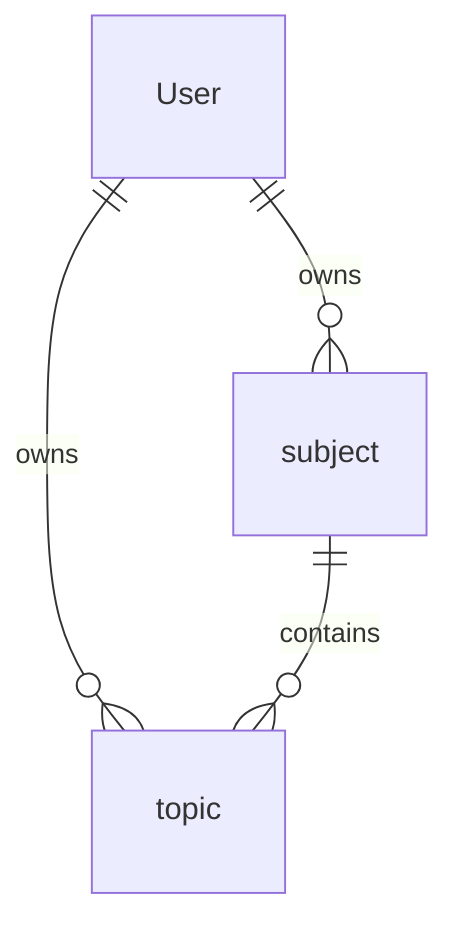
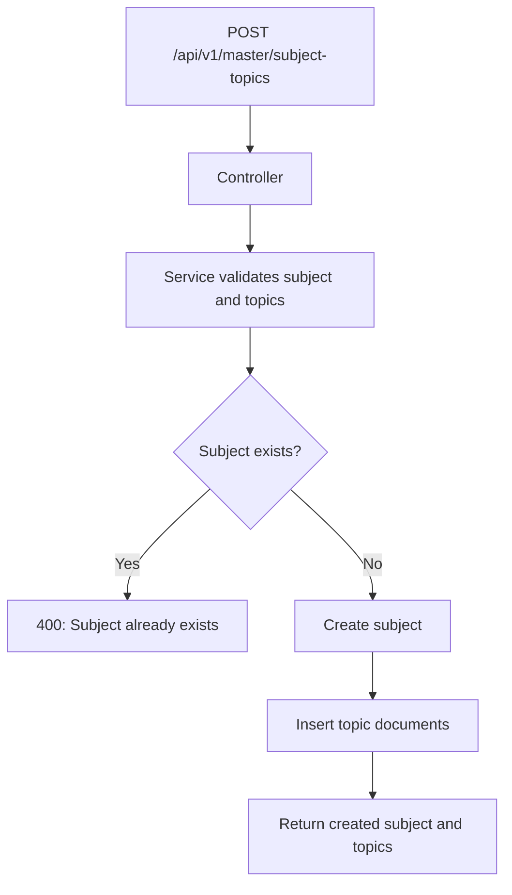

# Master Content

[← Back to Feature Overview](README.md)  
[← Back to System Architecture](../system-architecture.md)

## 1. Overview

The master content feature manages the subject and topic taxonomy owned by a user. Other modules use these records to classify MCQs and quizzes, so this feature provides the organizing layer for the rest of the app. Every route in the module requires JWT authentication.

## 2. Data Model

### `subject`

| Column | Type | Nullable | Default | Description |
| --- | --- | --- | --- | --- |
| `user` | `ObjectId` | No | None | Owning user. |
| `subject` | `String` | No | None | Subject name. |
| `active` | `Boolean` | No | `true` | Soft-delete flag. |

- Associations:
  - Belongs to `User`.
  - Is referenced by `topic`, `MCQ`, and `Quiz`.

### `topic`

| Column | Type | Nullable | Default | Description |
| --- | --- | --- | --- | --- |
| `user` | `ObjectId` | No | None | Owning user. |
| `subject` | `ObjectId` | No | None | Parent subject. |
| `topic` | `String` | No | None | Topic name. |
| `active` | `Boolean` | No | `true` | Soft-delete flag. |

- Associations:
  - Belongs to `User`.
  - Belongs to `subject`.
  - Is referenced by `MCQ`.

## 3. How It Works

1. `createSubjectAndTopic` checks whether the subject already exists for the user.
2. If it does not, the service creates the subject and then bulk inserts topics under it.
3. `createSubject` creates a single subject with the same uniqueness check.
4. `addTopic` ensures the subject id and topic name are present and that the combination is not already active for the user.
5. `updateSubjectById` and `updateTopicById` update the corresponding documents.
6. `deleteSubjectById` and `deleteTopicById` soft-delete by setting `active: false`.

## 4. API Endpoints

| Method | Path | Auth | Validation (Joi schema) | Controller method | Description |
| --- | --- | --- | --- | --- | --- |
| GET | `/api/v1/master/subjects` | Yes | None in the route layer | `getSubject` | Lists active subjects for the user. |
| DELETE | `/api/v1/master/subject/:subjectId` | Yes | None in the route layer | `deleteSubject` | Soft-deletes a subject. |
| DELETE | `/api/v1/master/topic/:topicId` | Yes | None in the route layer | `deleteTopic` | Soft-deletes a topic. |
| PUT | `/api/v1/master/subject/:subjectId` | Yes | None in the route layer | `updateSubject` | Renames a subject. |
| GET | `/api/v1/master/topics/:subjectId` | Yes | None in the route layer | `getTopics` | Lists active topics for a subject. |
| PUT | `/api/v1/master/topic/:topicId` | Yes | None in the route layer | `updateTopic` | Renames a topic. |
| POST | `/api/v1/master/subject-topics` | Yes | None in the route layer | `addSubjectAndTopics` | Creates a subject and many topics in one request. |
| POST | `/api/v1/master/subject` | Yes | None in the route layer | `addSubject` | Creates one subject. |
| POST | `/api/v1/master/topic` | Yes | None in the route layer | `addTopic` | Creates one topic under a subject. |

## 5. Background Jobs & Integrations

No background jobs or external integrations are defined for this module.

## 6. Validation & Edge Cases

- Subject creation rejects duplicates for the same user when `active: true`.
- Topic creation rejects duplicates for the same user/subject pair when `active: true`.
- Topic creation requires `subjectId` and `topic`.
- Subject updates reject empty payloads.
- Topic updates reject empty payloads.
- Deletion is implemented as soft delete by toggling `active` rather than removing the document.

## 7. Key Files

| File | Purpose |
| --- | --- |
| `modules/master/index.js` | Defines the protected subject/topic routes. |
| `modules/master/controller.js` | Handles HTTP requests for master content. |
| `modules/master/service.js` | Enforces uniqueness and soft-delete rules. |
| `modules/master/repository.js` | Wraps Mongoose queries for subjects and topics. |
| `modules/master/subjectModel.js` | Subject schema. |
| `modules/master/topicModel.js` | Topic schema. |

## 8. Related Features

- [MCQ Library](03-mcq-library.md)
- [Quiz Engine](04-quiz-engine.md)
- [Performance Analytics](05-performance-analytics.md)

