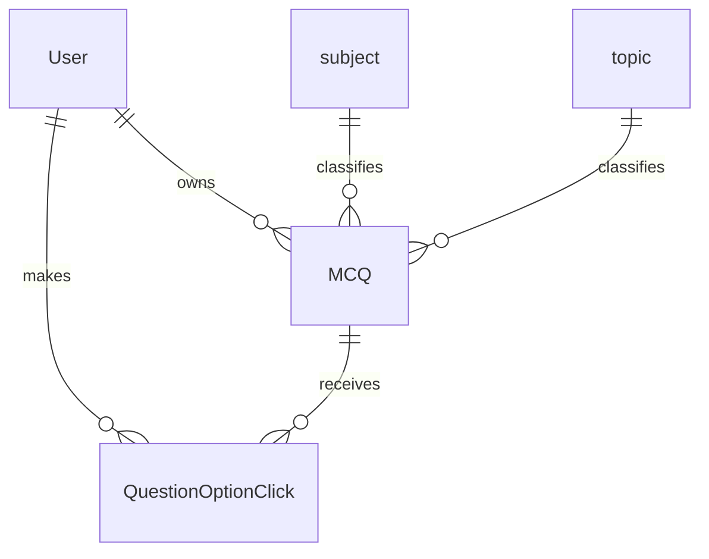
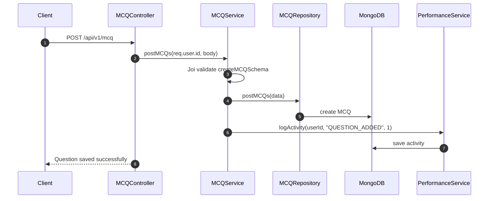

# MCQ Library

[← Back to Feature Overview](README.md)  
[← Back to System Architecture](../system-architecture.md)

## 1. Overview

The MCQ library feature manages question creation, reading, updating, deletion, bookmarking, comments, and question-option click analytics. The module is fully authenticated and scopes data by the current user. It also records activity in the performance module when questions are added or updated.

## 2. Data Model

### `MCQ`

| Column | Type | Nullable | Default | Description |
| --- | --- | --- | --- | --- |
| `user` | `ObjectId` | No | None | Owning user. |
| `question` | `String` | No | None | Question text. |
| `options` | `String[]` | No | None | Answer choices. |
| `correctAnswer` | `String` | No | None | Correct option text. |
| `difficulty` | `String` | No | `easy` | `easy`, `medium`, or `hard`. |
| `subject` | `ObjectId` | Yes | None | Optional subject reference. |
| `topic` | `ObjectId` | Yes | None | Optional topic reference. |
| `tag` | `String[]` | Yes | None | Optional tags. |
| `explanation` | `String` | Yes | None | Optional explanation text. |
| `bookmark` | `Boolean` | No | `false` | Bookmark flag. |
| `status` | `Boolean` | No | `true` | Active flag. |
| `comments` | Embedded array | Yes | `[]` | Embedded comment documents. |

- Associations:
  - Belongs to `User`.
  - Optionally references `subject` and `topic`.
  - Contains embedded comments with a `user` reference.

### `QuestionOptionClick`

| Column | Type | Nullable | Default | Description |
| --- | --- | --- | --- | --- |
| `user` | `ObjectId` | No | None | User that clicked an option. |
| `question` | `ObjectId` | No | None | Question that was clicked. |
| `selectedAnswer` | `String` | No | None | Option text selected by the user. |
| `isCorrect` | `Boolean` | No | None | Whether the selected answer matches the correct answer. |

- Associations:
  - Belongs to `User`.
  - Belongs to `MCQ`.

## 3. How It Works

1. `getMCQs` builds a MongoDB aggregation pipeline from query parameters using `utils/queryBuilder.js`.
2. It returns paginated results and enriches each question with interaction stats from `QuestionOptionClick`.
3. `postMCQs` validates the payload with Joi, creates the question, and logs activity in the performance module.
4. `updateMCQ` loads the question first to enforce ownership before updating it and logging activity.
5. `bookmarkQuestion` updates the bookmark flag for an owned question.
6. `trackOptionClick` validates the selected answer, stores a click document, and returns per-question stats.
7. `getQuestionInteractionSummary` and `getQuestionInteractionDetail` aggregate click history into analytics payloads.
8. `addQuestionComment` appends an embedded comment to the MCQ document and populates commenter details on return.

## 4. API Endpoints

| Method | Path | Auth | Validation (Joi schema) | Controller method | Description |
| --- | --- | --- | --- | --- | --- |
| GET | `/api/v1/mcq` | Yes | Query-only; no Joi route middleware | `getMCQs` | Lists questions with filters, pagination, and interaction stats. |
| GET | `/api/v1/mcq/analytics/summary` | Yes | Query-only; no Joi route middleware | `getQuestionInteractionSummary` | Returns click analytics across questions. |
| GET | `/api/v1/mcq/:questionId/interactions` | Yes | Query-only; no Joi route middleware | `getQuestionInteractionDetail` | Returns detailed analytics for one question. |
| POST | `/api/v1/mcq/:questionId/comments` | Yes | `addQuestionCommentSchema` inside service | `addQuestionComment` | Adds a comment to a question. |
| POST | `/api/v1/mcq/:questionId/option-click` | Yes | `trackQuestionInteractionSchema` inside service | `trackOptionClick` | Records an option click and whether it was correct. |
| GET | `/api/v1/mcq/:questionId` | Yes | None in the route layer | `getMCQById` | Returns one owned question. |
| POST | `/api/v1/mcq` | Yes | `createMCQSchema` inside service | `postMCQ` | Creates a question. |
| PUT | `/api/v1/mcq` | Yes | `updateMCQSchema` exists, but the service currently validates only ownership and fields in the body | `updateMCQ` | Updates a question. |
| DELETE | `/api/v1/mcq/:questionId` | Yes | None in the route layer | `deleteMCQById` | Deletes a question. |
| PATCH | `/api/v1/mcq` | Yes | None in the route layer | `bookmarkQuestion` | Updates the bookmark flag. |

## 5. Background Jobs & Integrations

The module has no external service integrations. It does call the performance module lazily to log question-created and question-updated activity.

## 6. Validation & Edge Cases

### Joi rules

- `createMCQSchema` requires `user`, `question`, `options`, `correctAnswer`, and `difficulty`.
- `correctAnswer` must match one of the options.
- `difficulty` must be `easy`, `medium`, or `hard`.
- `updateMCQSchema` requires at least one field.
- `addQuestionCommentSchema` requires a trimmed comment between 1 and 1000 characters.
- `trackQuestionInteractionSchema` requires a selected answer.

### Business-rule checks

- Every read and mutation requires a user id.
- Ownership is checked before reading, updating, deleting, bookmarking, or commenting.
- `trackOptionClick` rejects answers that are not in the question's option list.
- `getMCQById` and `deleteMCQById` reject access to questions owned by another user.
- Query helpers support search, bookmark, subject, topic, difficulty, status, and date-range filtering.

## 7. Key Files

| File | Purpose |
| --- | --- |
| `modules/mcq/index.js` | Declares the authenticated MCQ routes. |
| `modules/mcq/controller.js` | Translates HTTP requests into service calls. |
| `modules/mcq/service.js` | Implements question logic and analytics. |
| `modules/mcq/repository.js` | Wraps Mongoose queries and aggregation. |
| `modules/mcq/model.js` | MCQ schema with embedded comments. |
| `modules/mcq/optionClickModel.js` | Click-tracking schema. |
| `modules/mcq/joiSchema.js` | Joi schemas for question and interaction payloads. |

## 8. Related Features

- [Master Content](02-master-content.md)
- [Quiz Engine](04-quiz-engine.md)
- [Performance Analytics](05-performance-analytics.md)

