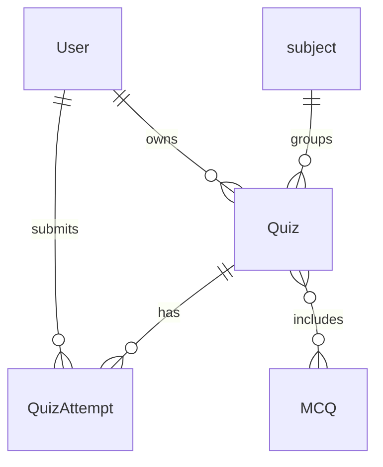
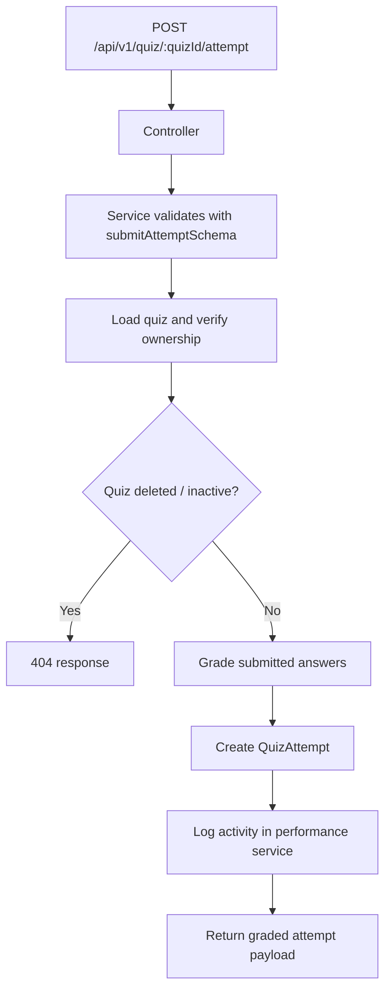

# Quiz Engine

[← Back to Feature Overview](README.md)  
[← Back to System Architecture](../system-architecture.md)

## 1. Overview

The quiz engine feature creates quizzes from explicit question ids or MCQ filters, returns quizzes for review or play, updates and soft-deletes quizzes, and grades quiz attempts. It is fully authenticated and scoped to the owning user. It also logs quiz attempts into the performance module.

## 2. Data Model

### `Quiz`

| Column | Type | Nullable | Default | Description |
| --- | --- | --- | --- | --- |
| `user` | `ObjectId` | No | None | Owning user. |
| `title` | `String` | No | None | Quiz title. |
| `description` | `String` | Yes | `""` | Optional description. |
| `subject` | `ObjectId` | Yes | `null` | Optional subject filter. |
| `questions` | `ObjectId[]` | No | `[]` | MCQ references included in the quiz. |
| `settings.shuffleQuestions` | `Boolean` | No | `false` | Quiz setting. |
| `settings.shuffleOptions` | `Boolean` | No | `false` | Quiz setting. |
| `settings.timeLimit` | `Number` | No | `0` | Time limit in minutes; `0` means no limit. |
| `active` | `Boolean` | No | `true` | Active flag. |
| `deleted` | `Boolean` | No | `false` | Soft-delete flag. |

- Associations:
  - Belongs to `User`.
  - Optionally references `subject`.
  - References many `MCQ` ids through `questions`.

### `QuizAttempt`

| Column | Type | Nullable | Default | Description |
| --- | --- | --- | --- | --- |
| `user` | `ObjectId` | No | None | User who submitted the attempt. |
| `quiz` | `ObjectId` | No | None | Quiz being attempted. |
| `answers` | Embedded array | Yes | `[]` | Answer records. |
| `score` | `Number` | No | None | Correct-answer count. |
| `totalQuestions` | `Number` | No | None | Number of questions in the quiz. |
| `timeTaken` | `Number` | Yes | `0` | Time spent in seconds. |

- Associations:
  - Belongs to `User`.
  - Belongs to `Quiz`.

## 3. How It Works

1. `createQuiz` validates the payload with Joi.
2. If `questionIds` is empty, it builds a Mongo aggregation query from the supplied filters and samples questions from MCQ documents.
3. It stores the quiz and returns the created record.
4. `getQuizById` hides correct answers unless `review=true` is passed in the query string.
5. `updateQuiz` merges settings and replaces quiz question ids when provided.
6. `deleteQuiz` soft-deletes by setting `deleted: true`.
7. `submitAttempt` validates answers, grades each question, stores the attempt, and logs activity in the performance module.
8. `getAttempts` and `getAttemptById` add percentage and answer-summary metadata to the returned attempt data.

## 4. API Endpoints

| Method | Path | Auth | Validation (Joi schema) | Controller method | Description |
| --- | --- | --- | --- | --- | --- |
| POST | `/api/v1/quiz` | Yes | `createQuizSchema` inside service | `createQuiz` | Creates a quiz from question ids or filters. |
| GET | `/api/v1/quiz` | Yes | Query-only; no Joi route middleware | `getQuizzes` | Lists quizzes for the user. |
| GET | `/api/v1/quiz/:quizId` | Yes | Query-only; no Joi route middleware | `getQuizById` | Returns one quiz, hiding answers unless review mode is enabled. |
| PUT | `/api/v1/quiz/:quizId` | Yes | `updateQuizSchema` inside service | `updateQuiz` | Updates quiz metadata, questions, active state, or settings. |
| DELETE | `/api/v1/quiz/:quizId` | Yes | None in the route layer | `deleteQuiz` | Soft-deletes a quiz. |
| POST | `/api/v1/quiz/:quizId/attempt` | Yes | `submitAttemptSchema` inside service | `submitAttempt` | Grades and stores a quiz attempt. |
| GET | `/api/v1/quiz/:quizId/attempts` | Yes | None in the route layer | `getAttempts` | Lists attempts for one quiz. |
| GET | `/api/v1/quiz/:quizId/attempts/:attemptId` | Yes | None in the route layer | `getAttemptById` | Returns one attempt with populated questions. |

## 5. Background Jobs & Integrations

No external service integrations are defined. The module lazily calls the performance service to log quiz attempts as activity.

## 6. Validation & Edge Cases

### Joi rules

- `createQuizSchema` requires `title`.
- `questionIds` defaults to an empty array.
- `filters.subject`, `filters.topic`, and `filters.difficulty` are optional.
- `filters.limit` is constrained to 1..100.
- `settings.shuffleQuestions`, `settings.shuffleOptions`, and `settings.timeLimit` default to safe values.
- `updateQuizSchema` requires at least one field.
- `submitAttemptSchema` requires an answers array and validates per-answer fields.

### Business-rule checks

- Quiz ownership is enforced before reads, updates, deletes, and attempt retrieval.
- If a quiz has no explicit question ids and filter sampling finds no questions, creation fails.
- `submitAttempt` rejects answers that are not in the question options list.
- Soft-deleted quizzes are treated as not found.
- `getQuizById` strips `correctAnswer` unless review mode is requested.

## 7. Key Files

| File | Purpose |
| --- | --- |
| `modules/quiz/index.js` | Declares the protected quiz routes. |
| `modules/quiz/controller.js` | Translates HTTP requests into service calls. |
| `modules/quiz/service.js` | Implements quiz selection, grading, and attempt logic. |
| `modules/quiz/repository.js` | Wraps quiz and attempt queries. |
| `modules/quiz/model.js` | Quiz schema. |
| `modules/quiz/attemptModel.js` | Quiz attempt schema. |
| `modules/quiz/joiSchema.js` | Joi schemas for quiz and attempt payloads. |

## 8. Related Features

- [MCQ Library](03-mcq-library.md)
- [Performance Analytics](05-performance-analytics.md)

