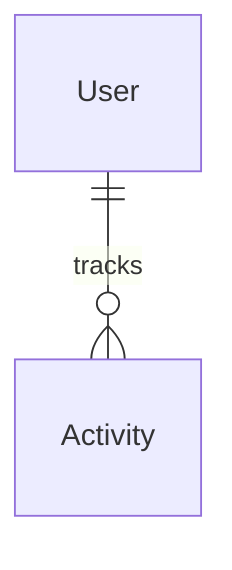
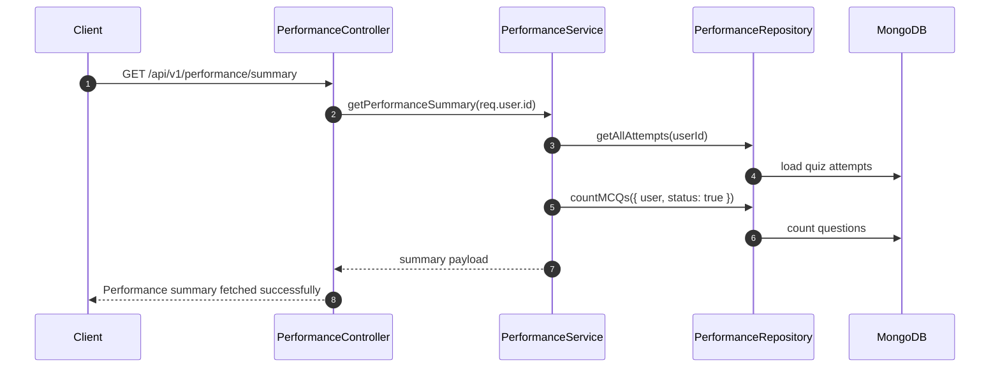

# Performance Analytics

[← Back to Feature Overview](README.md)  
[← Back to System Architecture](../system-architecture.md)

## 1. Overview

The performance feature aggregates activity, streaks, quiz performance, subject-wise performance, difficulty-wise performance, and a compact summary. It is a read-heavy module that derives metrics from `Activity`, `MCQ`, and `QuizAttempt` documents. All routes require JWT authentication.

## 2. Data Model

### `Activity`

| Column | Type | Nullable | Default | Description |
| --- | --- | --- | --- | --- |
| `user` | `ObjectId` | No | None | User being tracked. |
| `date` | `Date` | No | Start of the current day | Day bucket for activity aggregation. |
| `questionsAdded` | `Number` | No | `0` | Number of question-creation or update actions. |
| `practiceAttempts` | `Number` | No | `0` | Number of practice attempts. |
| `practiceSessions` | `Number` | No | `0` | Number of practice sessions. |
| `revisionsAttempts` | `Number` | No | `0` | Number of revision attempts. |
| `revisionsSessions` | `Number` | No | `0` | Number of revision sessions. |
| `totalActivity` | `Number` | No | `0` | Sum used by streak and summary calculations. |

- Associations:
  - Belongs to `User`.
  - Indexed by `user` and `date`.

## 3. How It Works

1. `logActivity` upserts a daily activity record and increments the correct counters based on the activity type.
2. `getDailyActivityStats` returns the user's activity records for a date range.
3. `getStreakRecord` calculates current streak and longest streak from recent activity days.
4. `getQuizPerformanceStats` summarizes quiz attempts for a date range.
5. `getSubjectWisePerformance` aggregates correctness and score by subject.
6. `getDifficultyWisePerformance` aggregates correctness and score by difficulty.
7. `getPerformanceSummary` rolls up counts across attempts and MCQs.

## 4. API Endpoints

| Method | Path | Auth | Validation (Joi schema) | Controller method | Description |
| --- | --- | --- | --- | --- | --- |
| GET | `/api/v1/performance/daily-activity` | Yes | `dateRangeSchema` in controller | `getDailyActivityStats` | Returns daily activity rows for a date range. |
| GET | `/api/v1/performance/streak` | Yes | None in the route layer | `getStreakRecord` | Returns current and longest streak. |
| GET | `/api/v1/performance/quiz-stats` | Yes | `dateRangeSchema` in controller | `getQuizPerformanceStats` | Returns quiz attempt stats for a date range. |
| GET | `/api/v1/performance/subject-wise` | Yes | `dateRangeSchema` in controller | `getSubjectWisePerformance` | Returns subject-wise performance metrics. |
| GET | `/api/v1/performance/difficulty-wise` | Yes | `dateRangeSchema` in controller | `getDifficultyWisePerformance` | Returns difficulty-wise performance metrics. |
| GET | `/api/v1/performance/summary` | Yes | None in the route layer | `getPerformanceSummary` | Returns an overall performance summary. |

## 5. Background Jobs & Integrations

No background jobs or external integrations are defined. The module is fed by lazy calls from the MCQ and Quiz services that log activity into MongoDB.

## 6. Validation & Edge Cases

- `dateRangeSchema` requires ISO date strings for both `startDate` and `endDate`.
- The controller returns a `400` response immediately if date validation fails.
- `logActivity` never throws to the caller; it logs and returns `null` or `false` on internal failure.
- Streak calculation treats today or yesterday as the only valid streak start points.
- Difficulty stats default to `Easy`, `Medium`, and `Hard` buckets even if one bucket has no data.

## 7. Key Files

| File | Purpose |
| --- | --- |
| `modules/performance/index.js` | Declares the protected analytics routes. |
| `modules/performance/controller.js` | Validates date ranges and formats analytics responses. |
| `modules/performance/service.js` | Calculates and logs activity and analytics. |
| `modules/performance/repository.js` | Wraps activity, MCQ, and attempt queries. |
| `modules/performance/model.js` | Activity schema with the date index. |
| `modules/performance/joiSchema.js` | Date range validation schema. |

## 8. Related Features

- [MCQ Library](03-mcq-library.md)
- [Quiz Engine](04-quiz-engine.md)

