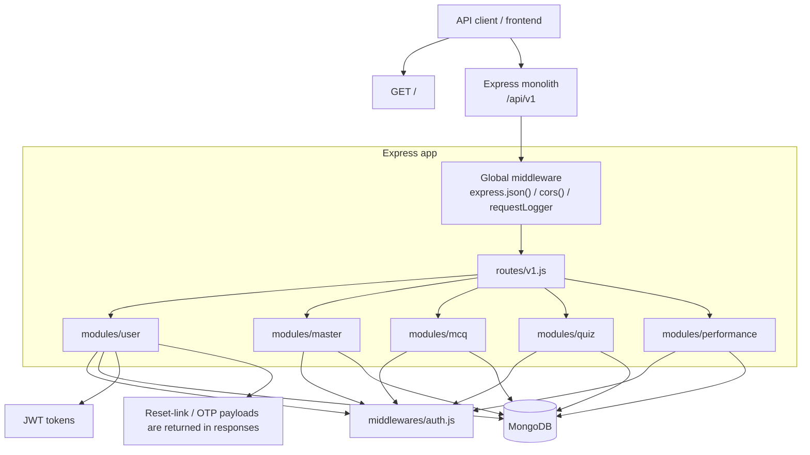
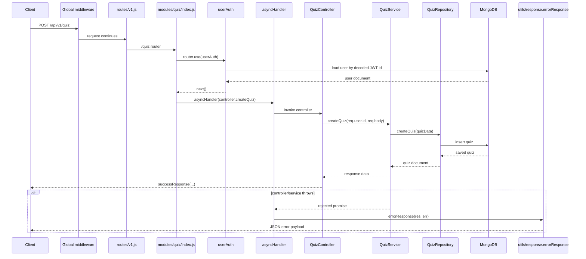

# System Architecture

[← Back to Documentation Index](README.md)

## 2.1 System Overview

QMark Backend is a monolithic Express API for a quiz application. It supports user accounts, subject/topic management, an MCQ library, quiz creation and attempts, and performance reporting. The live app connects to MongoDB through Mongoose and uses JWTs for authenticated requests.

The codebase is a single-node monolith with five domain modules under `modules/`: `user`, `master`, `mcq`, `quiz`, and `performance`. There is no Redis, queue worker, or separate microservice in the current code.

## 2.2 Technology Stack

| Layer | Technology | Version | Purpose |
| --- | --- | --- | --- |
| Runtime | Node.js | Not pinned in `package.json` | Runs the server process. |
| Web framework | Express | `^4.21.2` | HTTP server and routing. |
| Database driver / ODM | Mongoose | `^8.10.0` | MongoDB connection and data models. |
| Database | MongoDB | Not pinned in `package.json` | Primary persistent store. |
| Auth | jsonwebtoken | `^9.0.2` | JWT signing and verification. |
| Password hashing | bcryptjs | `^3.0.2` | Password hashing and comparison. |
| Validation | Joi | `^17.13.3` | Request/body validation inside services and controllers. |
| CORS | cors | `^2.8.5` | Cross-origin request support. |
| Environment config | dotenv | `^16.4.7` | Loads `.env` into `process.env`. |
| Dev tooling | nodemon | Not listed in `dependencies` | Used by `npm run dev`. |

## 2.3 High-Level Architecture Diagram

## 2.4 Request Flow

## 2.5 The Portals / Route Surfaces

| Prefix | Router file | Audience | Auth requirement |
| --- | --- | --- | --- |
| `/` | `app.js` | Health check / server probe | None |
| `/api/v1` | `routes/v1.js` | API entry point | None at the mount point |
| `/api/v1/user` | `modules/user/index.js` | User account flows | Public for auth flows, protected for profile/password |
| `/api/v1/master` | `modules/master/index.js` | Subject/topic management | JWT required on the router |
| `/api/v1/mcq` | `modules/mcq/index.js` | Question library and analytics | JWT required on the router |
| `/api/v1/quiz` | `modules/quiz/index.js` | Quiz creation and attempts | JWT required on the router |
| `/api/v1/performance` | `modules/performance/index.js` | Activity and performance metrics | JWT required on the router |

## 2.6 Running Locally

1. Install dependencies with `npm install`.
2. Create or update `.env` with the variables used by the code: `MONGODB_URI`, `JWT_SECRET`, `FRONTEND_URL`, and `PORT`.
3. No migrations or seed scripts exist in `package.json`; the app relies on Mongoose models directly.
4. Start the development server with `npm run dev` or the production-style server with `npm start`.

## 2.7 Deep-Dive Index

1. [architecture/01-request-flow.md](architecture/01-request-flow.md)
2. [architecture/02-folder-structure.md](architecture/02-folder-structure.md)
3. [architecture/03-auth.md](architecture/03-auth.md)
4. [architecture/04-database.md](architecture/04-database.md)
5. [architecture/05-external-services.md](architecture/05-external-services.md)
6. [features/README.md](features/README.md)
7. [features/01-user-account.md](features/01-user-account.md)
8. [features/02-master-content.md](features/02-master-content.md)
9. [features/03-mcq-library.md](features/03-mcq-library.md)
10. [features/04-quiz-engine.md](features/04-quiz-engine.md)
11. [features/05-performance-analytics.md](features/05-performance-analytics.md)
